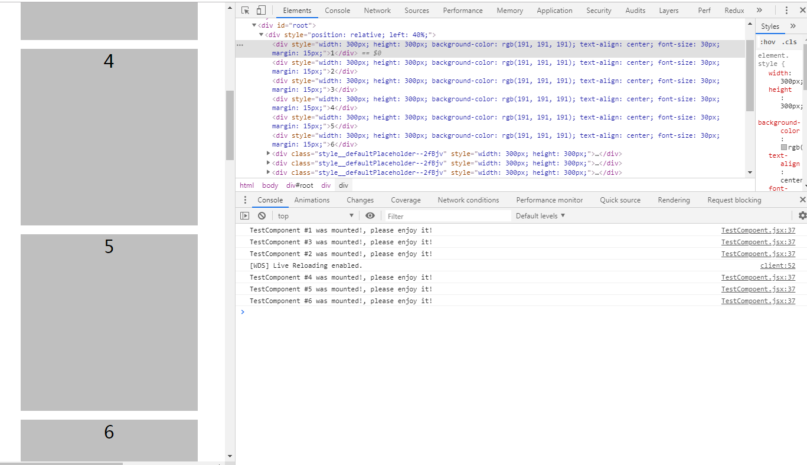

 

<div style="text-align:center">
  
</div> 

## react-intersectionObserver-lazy-load

react-intersectionObserver-lazy-load is a lazy-load component which helps you load your components(or other contents) when these components enter into viewport(or target viewport).   

<div style="text-align:center">
  
</div> 

**react-intersectionObserver-lazy-load bases on Intersection Observer API**

Quoted from [MDN](https://developer.mozilla.org/en-US/docs/Web/API/IntersectionObserver):  
`The IntersectionObserver interface of the Intersection Observer API provides a way to asynchronously observe changes in the intersection of a target element with an ancestor element or with a top-level document's viewport. The ancestor element or viewport is referred to as the root.`  

# Installation  
`npm install react-intersection-observer-lazy-load`   
 
# Examples  
[basic demo](https://promise-coding.github.io/react-intersectionObserver-lazy-load/)

# Usage  
```js   
import React from 'react'
import { render } from 'react-dom'
import LazyLoadComponent from 'react-intersectionObserver-lazy-load'
import TestComponent from './TestCompoent';

const App = () => {
    return (
        {[1,2,3,4,5,6,7,8,9,10,11,12,13,14,15,16].map((value) => {
            return <LazyLoadComponent key={value}>
                <TestComponent id={value}/>
            </LazyLoadComponent>
        })}
    );

};

render(<App />, document.getElementById('root'));
```

# Props  
1、options  
Type: `Object`  Default: `{root: null, rootMargin: '0px 0px 0px 0px',threshold: []}`  
options config sames as [IntersectionObserver](https://developer.mozilla.org/en-US/docs/Web/API/IntersectionObserver):
##### root  

`A specific ancestor of the target element being observed. If no value was passed to the constructor or this is null, the top-level document's viewport is used.`  

##### rootMargin  
`An offset rectangle applied to the root's bounding box when calculating intersections, effectively shrinking or growing the root for calculation purposes. The value returned by this property may not be the same as the one specified when calling the constructor as it may be changed to match internal requirements. Each offset can be expressed in pixels (px) or as a percentage (%). The default is "0px 0px 0px 0px".`
##### thresholds  
`A list of thresholds, sorted in increasing numeric order, where each threshold is a ratio of intersection area to bounding box area of an observed target. Notifications for a target are generated when any of the thresholds are crossed for that target. If no value was passed to the constructor, 0 is used.`  

2、defaultPlaceholderStyle  
Type: `Object`  Default: `{width:300, height:300}`  
a default placeholder is presented when a component is not loaded, the `defaultPlaceholderStyle` config is setting to default `placeholder`, default `width` is 300px and `height` is 300px;  

3、placeholder  
Type: `Element`  Default: `null`  
`react-intersectionObserver-lazy-load` provides a default placeholder, and you also set your own placeholder. 
